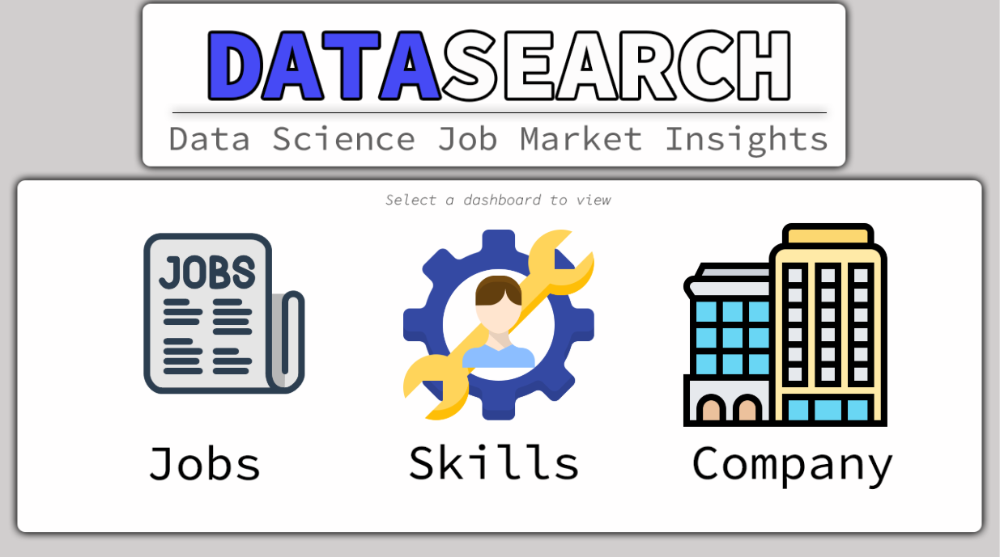
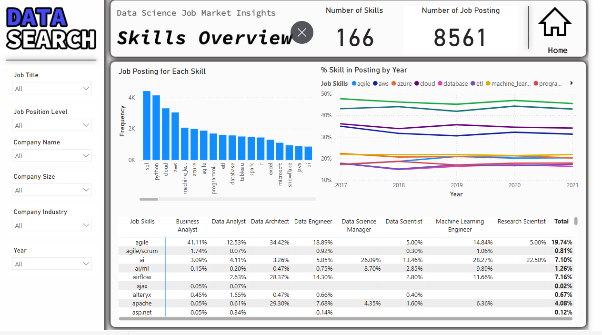
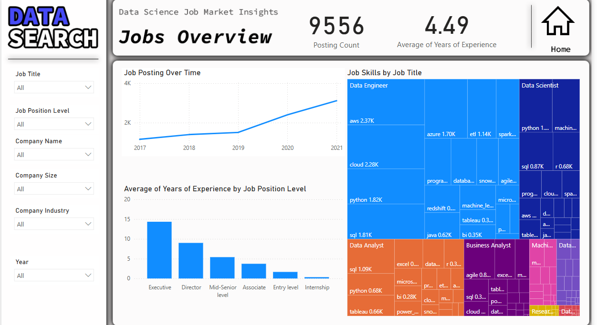
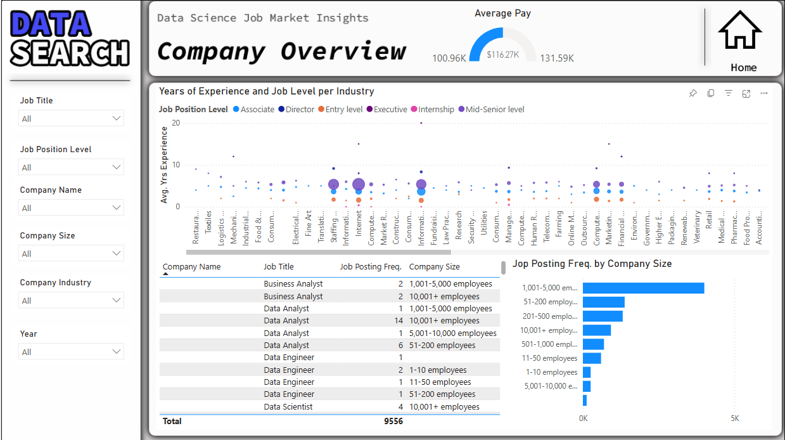

## 📈 Job Market Trends in Data Careers – Power BI Dashboard

This Power BI project analyzes job market trends in data-related careers, including data science, data analytics, data engineering, and other emerging roles in the field. The goal is to understand how the demand for data professionals has evolved over time and what employers are currently looking for.

### 🔍 Key Insights Covered:

- **Job Trends Over Time:** Explore how demand for data roles has grown or shifted across different years.
- **Skills in Demand:** Identify top technical and soft skills employers are looking for, and how skill requirements have changed over time.
- **Role-Specific Evolution:** Compare how skill expectations differ across roles like data analyst, data scientist, and data engineer.
- **Company & Salary Insights:** Analyze which companies are posting these jobs, their company sizes, and the associated salary ranges.

This dashboard is intended to support job seekers, career advisors, and workforce planners in navigating the evolving landscape of data-related careers.

[See the dashboard](Snapshots/interactive.mp4)

> **Note:** This project was completed as part of a DataCamp learning course and demonstrates applied skills in data visualization, trend analysis, and dashboard storytelling using Power BI.
